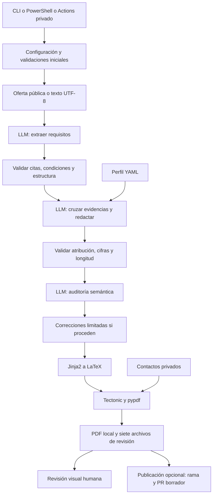

# Flujo de generación de CV

El perfil maestro aporta los hechos; la oferta determina qué destacar. Los modelos
devuelven JSON y el código decide si cumple las reglas antes de generar el PDF.

## Etapas y herramientas

| Etapa | Implementación | Herramientas / contrato |
|---|---|---|
| Entrada | `cli.py`, `config.py`, `tailor.ps1` | argparse, TOML de Python, variables de entorno |
| Coordinación | `pipeline.py`; `run.py` conserva el comando original | Python, hashes SHA-256, etapas y correcciones limitadas |
| Perfil y herramientas | `preflight.py` | PyYAML, estructura/IDs/fecha/versionado; detección de Tectonic y del proveedor |
| Descargar oferta | `extract.py` | urllib, HTMLParser, JSON-LD, URL canónica; texto manual como alternativa |
| Extraer requisitos | `prompts/extract.txt`, `schemas.py` | JSON Schema: citas, prioridad, condición, lógica single/any/all y opciones |
| Cruzar y adaptar | `prompts/adapt.txt`, `match.py` | Cobertura de todos los requisitos, IDs conocidos, atribución por empleo, cifras y límites de palabras |
| Auditar | `prompts/audit.txt`, `repair.py` | LLM contrasta oferta/perfil/borrador; Python aplica correcciones conservadoras |
| Proveedores | `providers/`, `llm.py` | Codex CLI, Responses API o Chat Completions compatible; validación común y reintentos limitados |
| Recuperación | `state.py` | Checkpoints privados por slug; escritura atómica y bloqueo de concurrencia |
| Maquetar | `generate.py`, `templates/`, `layout.tex` | Jinja2, escape de texto a LaTeX, datos maestros conservados |
| PDF | `validate.py` | Tectonic aislado, pypdf, páginas, texto, contactos, overflow y glifos |
| Publicar | `publish.py` | Git, lista de siete archivos, verificación de base/diff completo, API de GitHub |
| CI | `checks.yml` | unittest en Python 3.12, sin claves ni LLM |

## Correcciones y límites

Normalmente se necesitan tres solicitudes: extraer, adaptar y auditar. Una extracción
con citas inválidas permite una corrección. Un borrador inválido permite otra.
Si la auditoría detecta errores semánticos de extracción, se repite una vez la secuencia
extraer/adaptar/auditar. Las afirmaciones dudosas pueden sustituirse por una evidencia
literal y auditarse una vez más. Máximo: nueve solicitudes lógicas antes de reintentos
de transporte, sujetas al presupuesto global de solicitudes.

`single` representa un requisito individual; `any`, alternativas explícitas donde basta
una; `all`, opciones exigidas conjuntamente. `condition` conserva cuándo se aplica.
La validación estructural no demuestra la interpretación semántica: sigue siendo
responsabilidad del auditor y de la revisión humana.

Se mantiene el perfil sin aprendizaje automático de sus propios borradores. Los
resultados registran hashes del perfil, fuente, código y prompts, llamadas, duración,
tokens cuando el proveedor los entrega y feedback de las correcciones.

## Resultados

- `roles/<slug>/source.md`: origen y hash, sin la oferta completa.
- `job.json`: requisitos y citas; `adaptation.json`: redacción con evidencias.
- `match.md`: cobertura, condiciones, lógica y carencias.
- `decisions.md`: decisiones editoriales y preguntas pendientes.
- `cv.tex`: documento sin contactos; `validation.json`: trazabilidad y controles.
- `build/<slug>/cv.pdf`: PDF completo local.
- `.private/runs/<slug>/`: fuente, respuestas, diagnósticos y checkpoints privados.

Los contactos se comprueban antes de enviar datos y antes de guardar resultados.
El LLM no recibe el archivo de contactos. La compilación los añade después. El PDF
se copia al destino final tras superar los controles de contenido y estabilidad.
La revisión visual sigue marcada como pendiente; el sistema no envía candidaturas.
